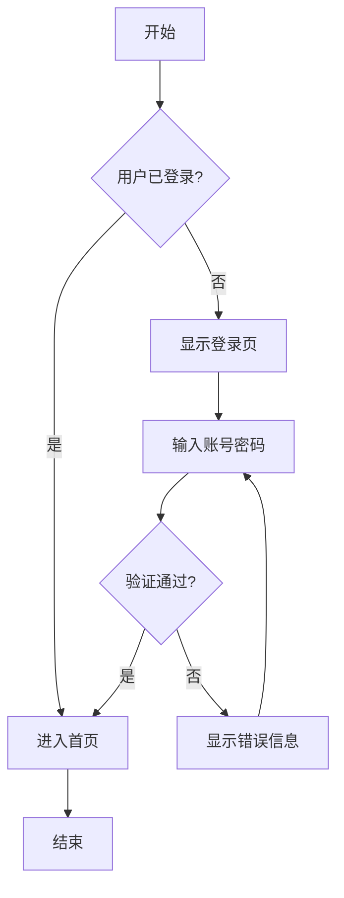
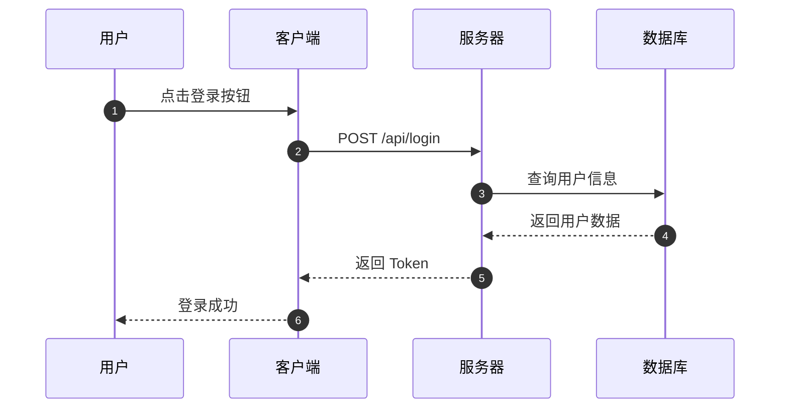
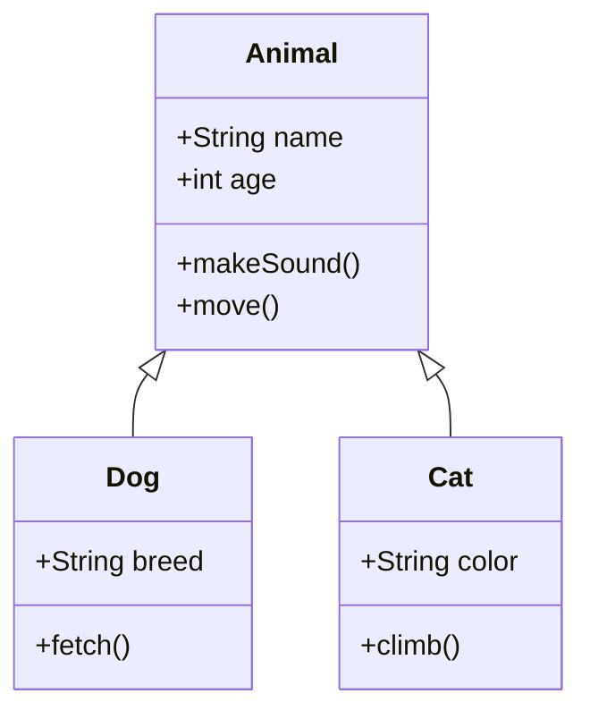
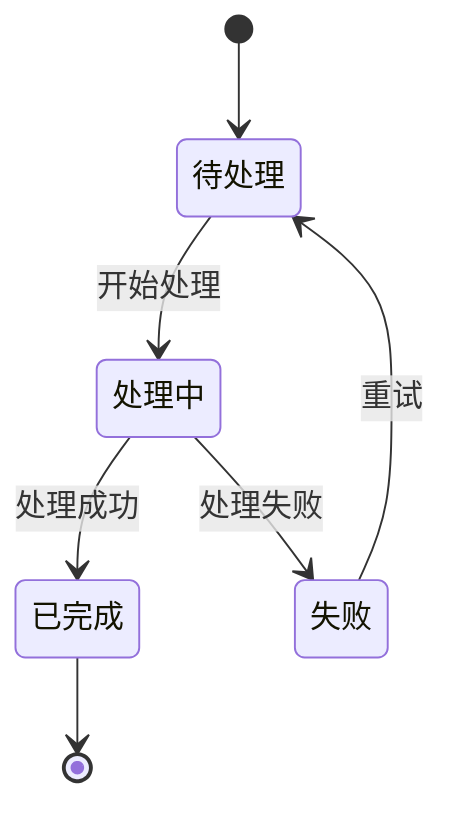
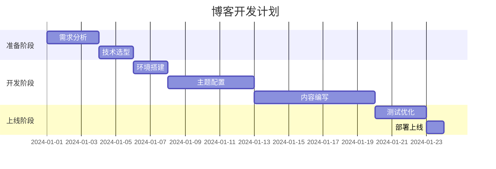
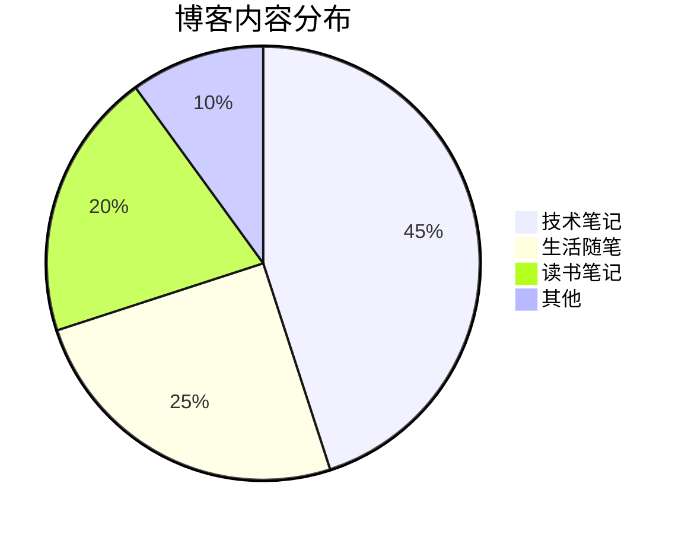
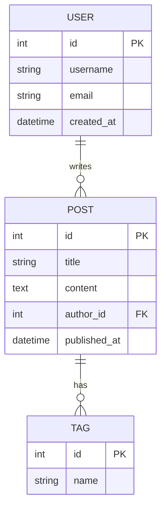

## 什么是 Mermaid？

[Mermaid](https://mermaid.js.org/) 是一个基于 JavaScript 的图表绘制工具，它使用类似 Markdown 的文本语法来生成图表。FixIt 主题内置了 Mermaid 支持，可以直接在 Markdown 中绘制各种图表。

## 流程图

以下是一个简单的登录流程图：

## 时序图

展示系统交互的时序图：

## 类图

展示面向对象设计的类图：

## 状态图

展示状态转换：

## 甘特图

项目进度规划：

## 饼图

数据占比展示：

## ER 图

数据库实体关系图：

## 总结

Mermaid 让在博客中插入图表变得非常简单，无需借助外部工具，直接用文本描述即可生成专业的图表。配合 FixIt 主题的手绘风格（`look = "handDrawn"`），图表既美观又有特色。

---

*本文最后更新于 *
